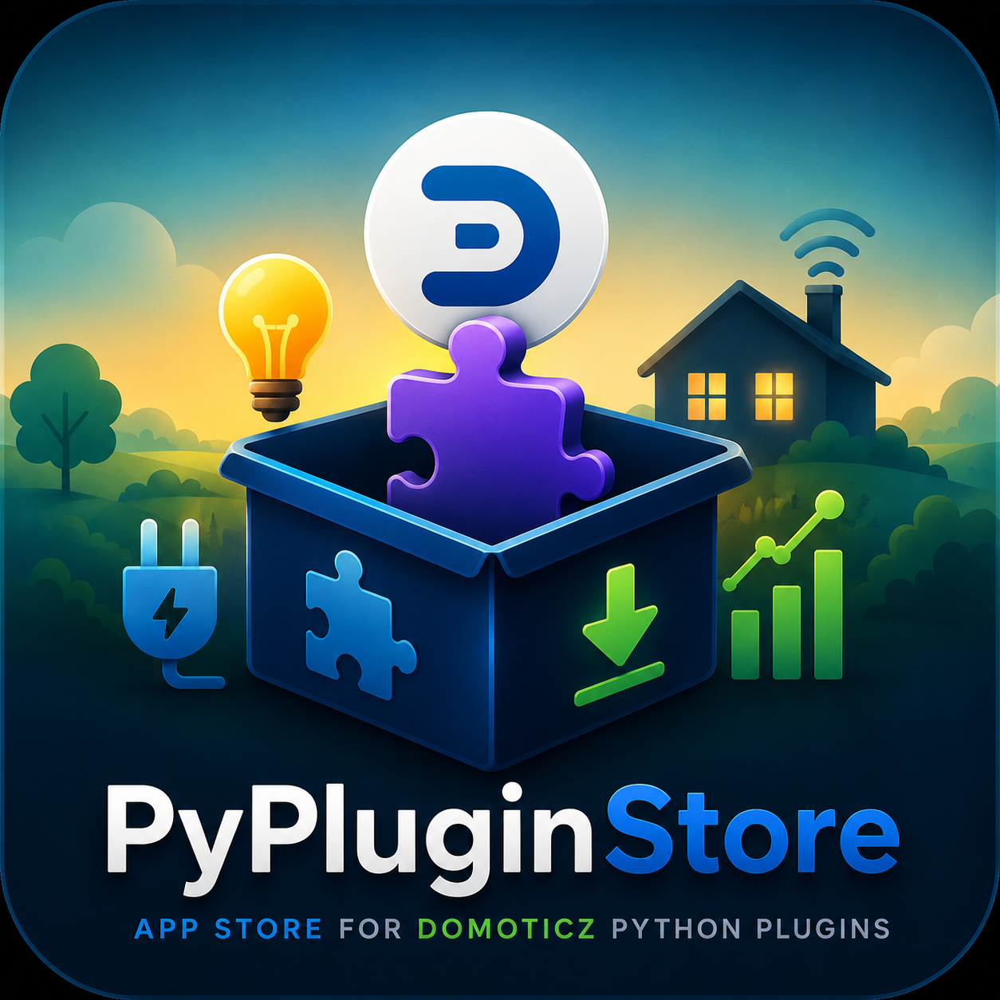
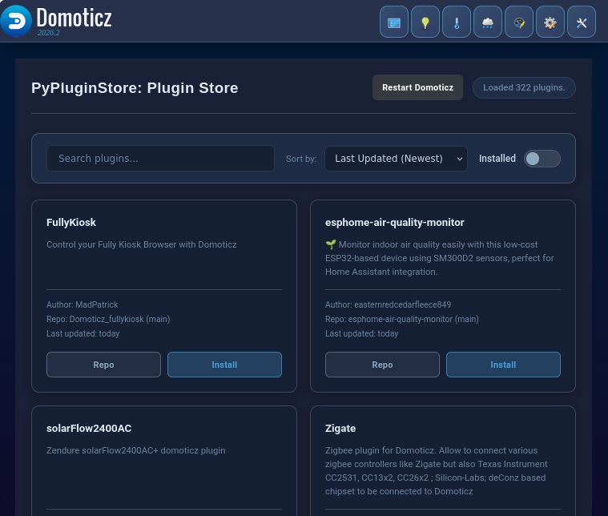

# PyPluginStore for Domoticz (PyPluginStore)

A robust and modern plugin manager for Domoticz that allows you to install and automatically update other Python plugins directly from GitHub.

**Supported platforms:** PyPluginStore supports Linux, including Raspberry Pi, and Windows Domoticz installations with Python plugin support. Individual third-party plugins may still be Linux-only or Windows-only depending on their own dependencies and OS integrations.



> This project is based on the original [ycahome/pp-manager](https://github.com/ycahome/pp-manager). Thanks to the original maintainers and contributors for their hard work.

---

## 🚀 Key Features

*   **Custom Plugin Store UI:** A clean, modern web interface accessible from the Domoticz **Custom** menu.
*   **Search, Sort & Filter:** Find plugins in the registry with type-ahead search, sorting, and installed-plugin filtering.
*   **Install, Remove & Update:** Manage Domoticz Python plugins without manual folder management.
*   **Self Update:** PyPluginStore appears in the store under its installed folder name, so it can update itself like any other plugin.
*   **Update Status Checks:** Installed plugins show whether their git checkout is current or has updates available.
*   **Auto Updates & Notifications:** Automatically update installed plugins or run in notification-only mode.
*   **Restart Domoticz:** Request a Domoticz service restart from the Plugin Store UI after installs or updates.
*   **Dependency Management:** Install plugin dependencies with `uv` (recommended) or `pip`, or manage them manually.
*   **PEP 668 Compliant Isolation:** Dependencies are installed into `.shared_deps` without requiring `sudo` or global `pip` access.
*   **Remote and Local Registries:** Fetches the public `registry.json`, falls back to the bundled copy, and supports private/local overrides in `registry_local.json`.
*   **Security Scanning:** Uses AST-based scanning to flag risky plugin code before it is installed.



## 🛡️ Advanced Security Scanning

PyPluginStore includes **Abstract Syntax Tree (AST)** based security scanning to help protect your Domoticz instance from malicious plugins:
*   **Deep Execution Detection:** Detects calls to dangerous functions like `os.system`, `subprocess` (specifically `shell=True`), `eval`, `exec`, and `pickle`.
*   **Smart IP Filtering:** Automatically ignores private, loopback, and broadcast IP addresses, as well as version numbers in User Agents, to reduce false positives.
*   **Developer Overrides:** Supports `# security-ignore` or `# nosec` comments to manually silence known-safe code findings.
*   **Destructive Operation Blocking:** Flags destructive file operations such as `shutil.rmtree` or `os.remove`.
*   **AST Bomb & DoS Protection:** Implements hard file size limits (5MB) and recursive parsing exception handling to prevent malicious files from crashing your plugin manager.

---

## 📥 Installation

### Prerequisites

Before installing, check these items:

1.  **Domoticz has Python plugin support.**
    Confirmation: open the Domoticz about box and make sure Python support is enabled/listed.
2.  **Git is installed.**
    Confirmation: run `git --version` on the Domoticz host. On Linux, install it with your package manager, for example `sudo apt install git`. On Windows, install Git for Windows and make sure `git` is available on `PATH`.
3.  **The Domoticz user can write to the web folders.**
    PyPluginStore copies its page to `domoticz/www/templates` and its icon to `domoticz/www/images` on startup. In Docker setups, make sure those folders are persistent and writable inside the container.
4.  **A Python dependency installer is available.**
    `uv` is recommended. `pip` is the fallback. PyPluginStore prefers the Python interpreter running Domoticz via `python -m pip` before standalone `pip3` or `pip` commands.

### Step-by-step

1.  Open a shell on the Domoticz host and go to the Domoticz `plugins` folder.

Linux:
```bash
cd domoticz/plugins
```

Windows PowerShell:
```powershell
cd C:\path\to\domoticz\plugins
```

2.  Clone PyPluginStore as `00-PyPluginStore`.

Linux:
```bash
git clone https://github.com/adrighem/PyPluginStore.git 00-PyPluginStore
```

Windows PowerShell:
```powershell
git clone https://github.com/adrighem/PyPluginStore.git 00-PyPluginStore
```

Confirmation: the folder `00-PyPluginStore` exists and contains `plugin.py`, `pypluginstore.html`, and `pypluginstore-icon.png`.

3.  Restart Domoticz.

Linux example:
```bash
sudo systemctl restart domoticz.service
```

Windows service example:
```powershell
Restart-Service -Name Domoticz
```

Confirmation: the Domoticz log should contain lines like:

```text
PyPluginStore: Initialized version ...
PyPluginStore: Custom UI autoinstalled/updated: ...
PyPluginStore: Plugin Manager Ready. Use the 'Custom' menu to manage plugins.
```

If the log says `Custom UI autoinstall failed`, check write permissions for `domoticz/www/templates` and `domoticz/www/images`.

### Why `00-PyPluginStore`?

Domoticz loads Python plugins alphabetically by folder name. Prefixing with `00-` ensures that the manager loads first. This enables `PyPluginStore` to set up the shared dependency environment (`.shared_deps`) so other plugins can load their required libraries immediately on startup.

---

## ⚙️ Configuration

Do these steps in the Domoticz web UI after installation:

1.  Go to **Setup -> Hardware** and add new hardware of type **PyPluginStore**.
    Confirmation: the hardware is listed as enabled, and PyPluginStore creates its helper devices. If **PyPluginStore** is not available as a hardware type, restart Domoticz and re-check Python plugin support.
2.  Go to **Setup -> Users**, edit your user, and enable the **Custom** menu for that user.
    Confirmation: after saving, the top menu contains **Custom** for that user.
3.  Open **Custom -> pypluginstore**.
    Confirmation: the Plugin Store dashboard loads and shows the plugin registry.

The helper devices can exist even when the **Custom** menu is disabled. The dashboard will only appear after the **Custom** menu is enabled for the current Domoticz user.

If the hardware exists but **Custom -> pypluginstore** is missing:

1.  Confirm the current Domoticz user has the **Custom** menu enabled.
2.  Confirm the Domoticz log contains `Custom UI autoinstalled/updated`.
3.  Hard-refresh the browser with `Shift+F5`.
4.  In Docker, confirm `domoticz/www/templates/pypluginstore.html` and `domoticz/www/images/pypluginstore-icon.png` exist inside the running container.

Domoticz only shows the **Custom** menu when custom pages exist and the menu is enabled for the current user.

### Settings (Hardware Page)

*   **Auto Update:**
    *   **All:** Continuously updates all installed plugins.
    *   **All (NotifyOnly):** Checks all plugins for updates and notifies you.
    *   **None:** Disables auto-updating.
*   **Debug:** Set to True for detailed logging.

### Restart Button

The **Restart Domoticz** button asks the host OS to restart Domoticz. This is not handled by a Domoticz JSON API endpoint.

On Linux it tries these non-interactive service commands, in order:

1. `systemctl restart domoticz.service`
2. `sudo -n systemctl restart domoticz.service`
3. `service domoticz restart`
4. `sudo -n service domoticz restart`

On Windows it tries service commands such as PowerShell `Restart-Service -Name Domoticz` and `sc stop/start Domoticz`.

For the button to work, the user running Domoticz must have permission to restart the service. On Linux, use either a tightly scoped polkit rule or a tightly scoped sudoers rule. Do not grant broad passwordless sudo such as `NOPASSWD: ALL`, and do not allow arbitrary `systemctl` commands.

### Polkit Authorization (Recommended)
On systemd hosts, polkit can authorize the direct `systemctl restart domoticz.service` attempt without using `sudo`. This matches the first Linux command PyPluginStore tries.

Create `/etc/polkit-1/rules.d/49-pypluginstore-domoticz-restart.rules` as root:

```javascript
polkit.addRule(function(action, subject) {
    if (action.id == "org.freedesktop.systemd1.manage-units" &&
        subject.user == "domoticz" &&
        action.lookup("unit") == "domoticz.service" &&
        action.lookup("verb") == "restart") {
        return polkit.Result.YES;
    }
});
```

Keep the rule owned by root and not writable by the Domoticz user:

```bash
sudo chown root:root /etc/polkit-1/rules.d/49-pypluginstore-domoticz-restart.rules
sudo chmod 0644 /etc/polkit-1/rules.d/49-pypluginstore-domoticz-restart.rules
```

### Sudoers Configuration
If you prefer to use `sudo` or if the host does not support polkit, first find the OS user that runs Domoticz and the absolute command path that sudoers must match:

```bash
systemctl show -p User --value domoticz.service
ps -o user= -C domoticz
command -v systemctl
```

Then create a dedicated sudoers file with `visudo`:

```bash
sudo visudo -f /etc/sudoers.d/pypluginstore-domoticz-restart
```

Add one line, replacing `domoticz` with the Domoticz OS user and `/usr/bin/systemctl` with the `command -v systemctl` output:

```sudoers
domoticz ALL=(root) NOPASSWD: /usr/bin/systemctl restart domoticz.service
```

This matches the second Linux command PyPluginStore tries: `sudo -n systemctl restart domoticz.service`. The command must stay limited to `restart domoticz.service`; broader rules would let the Domoticz process control unrelated system services.

Validate the sudoers syntax and check the permission without prompting:

```bash
sudo visudo -c -f /etc/sudoers.d/pypluginstore-domoticz-restart
sudo chown root:root /etc/sudoers.d/pypluginstore-domoticz-restart
sudo chmod 0440 /etc/sudoers.d/pypluginstore-domoticz-restart
sudo -u domoticz sudo -n -l /usr/bin/systemctl restart domoticz.service
```

If the host does not use systemd, add the same kind of narrow rule for the exact service command path returned by `command -v service`:

```sudoers
domoticz ALL=(root) NOPASSWD: /usr/sbin/service domoticz restart
```

On Windows, restart permissions may require running Domoticz under an account that can control the Domoticz service. If restart permissions are not configured, PyPluginStore logs the command failures and Domoticz keeps running.

Restart command diagnostics are written to `restart_domoticz.log` in the PyPluginStore plugin folder. On Linux, the log ends with a failure summary when every restart command fails. On Windows, PyPluginStore probes whether PowerShell can run in the Domoticz service context, writes inspectable `restart_domoticz.ps1` and `restart_domoticz.cmd` helper files, and starts the actual restart through a one-shot Windows Task Scheduler task named `\PyPluginStore-Domoticz-Restart` running as `SYSTEM`. This keeps the restart helper out of the Domoticz service process tree and avoids depending on `.ps1` execution policy. If task creation or launch fails, the log contains the `schtasks.exe` output. If the task launches but no helper output appears, check Task Scheduler history for `\PyPluginStore-Domoticz-Restart`. If the log records a non-zero return code, stdout, or stderr from `Restart-Service` or `sc.exe`, use that command output to fix the service name, permissions, or local Windows service configuration.

---

## 📦 Manual Dependency Management

If you prefer to manage dependencies manually or are on a system where automatic installation is restricted, you can install the required libraries for your plugins manually.

PyPluginStore looks for shared dependencies in its own `.shared_deps` directory and adds it to `sys.path`.

To install dependencies for a specific plugin manually:
1.  Check the `requirements.txt` file in the plugin's folder.
2.  Install them into the `00-PyPluginStore/.shared_deps` folder:
    ```bash
    pip install -r /path/to/plugin/requirements.txt --target /path/to/domoticz/plugins/00-PyPluginStore/.shared_deps
    ```
    ```powershell
    python -m pip install -r C:\path\to\domoticz\plugins\PluginName\requirements.txt --target C:\path\to\domoticz\plugins\00-PyPluginStore\.shared_deps
    ```

---

## 📚 For Plugin Developers (Adding to the Registry)

To add your plugin to the manager, simply submit a Pull Request to update `registry.json` in this repository.

When a Pull Request modifying `registry.json` is merged, a GitHub Action automatically updates the registry metadata including the latest repository push timestamps.

### Local private registry

Private or local-only plugins can be added to `registry_local.json` in the PyPluginStore plugin folder. This file uses the same format as `registry.json`, is loaded after the public registry, and is ignored by git so it stays local to your Domoticz installation.

```json
{
    "MyPrivatePlugin": [
        "github-user-or-org",
        "private-repository-name",
        "Description shown in PyPluginStore",
        "main"
    ]
}
```

Entries in `registry_local.json` override public entries with the same key and show a **Local** badge in the Plugin Store UI. Installing or updating private repositories still requires the Domoticz host to have working git access to those repositories.

The first two values are normally the GitHub owner and repository name. A full Git clone URL is also accepted as the first value for private/local entries; in that case the repository-name value is ignored for cloning.

Registry entries can optionally include platform metadata. Existing list-style entries remain valid; PyPluginStore also accepts object-style entries with a `platforms` field such as `["linux", "windows"]`. Plugins without platform metadata are shown as unknown rather than blocked.

Maintainers can infer and add platform metadata with:

```bash
GITHUB_TOKEN="$(gh auth token)" python .github/scripts/detect_plugin_platforms.py --missing-only
```

The detector uses GitHub repository metadata, README/install text, selected source files, platform-specific imports, scripts, paths, and command usage. Generic Python plugins with no Linux-only or Windows-only evidence are classified as likely supporting both platforms.

---

## ⚠️ Security Warning
Auto-updating plugins without manually reviewing the code changes exposes your system to whatever the developer pushes. By using auto-update, you trust the developers of your installed plugins.

## 💬 Discussion & Support
Join the conversation on the official Domoticz forums:
https://forum.domoticz.com/viewtopic.php?t=44626
